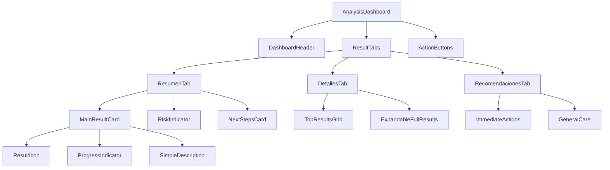

# Documento de Diseño - Dashboard de Análisis Intuitivo

## Visión General

El dashboard de análisis intuitivo transforma la experiencia de visualización de resultados de OncoDerma de una presentación técnica compleja a una interfaz moderna, minimalista y centrada en el usuario. El diseño utiliza principios de UX médico, jerarquía visual clara, y un sistema de información progresiva que permite a los usuarios acceder a diferentes niveles de detalle según sus necesidades.

## Arquitectura

### Arquitectura de Componentes



### Patrón de Diseño

- **Arquitectura**: Componentes modulares con estado compartido
- **Layout**: CSS Grid y Flexbox para responsividad
- **Estado**: Context API para datos del análisis
- **Animaciones**: Framer Motion para transiciones suaves
- **Theming**: Sistema de design tokens consistente

## Componentes e Interfaces

### Estructura de Componentes

```
src/components/dashboard/
├── AnalysisDashboard.jsx          # Componente principal
├── DashboardHeader.jsx            # Header con título y estado
├── ResultTabs.jsx                 # Sistema de pestañas
├── tabs/
│   ├── ResumenTab.jsx            # Pestaña de resumen
│   ├── DetallesTab.jsx           # Pestaña de detalles
│   └── RecomendacionesTab.jsx    # Pestaña de recomendaciones
├── cards/
│   ├── MainResultCard.jsx        # Tarjeta de resultado principal
│   ├── RiskIndicator.jsx         # Indicador de riesgo
│   ├── NextStepsCard.jsx         # Próximos pasos
│   └── CompactResultCard.jsx     # Tarjetas compactas para detalles
├── indicators/
│   ├── ProgressRing.jsx          # Anillo de progreso animado
│   ├── RiskBadge.jsx            # Badge de nivel de riesgo
│   └── ConfidenceIndicator.jsx   # Indicador de confianza
└── actions/
    ├── ActionButtons.jsx         # Botones de acción principales
    └── ShareModal.jsx           # Modal para compartir
```

### Interfaces de Datos

#### Modelo de Dashboard
```javascript
interface DashboardData {
  mainResult: {
    type: string;
    name: string;
    simpleName: string;
    probability: number;
    confidence: number;
    icon: string;
    description: string;
    riskLevel: 'low' | 'medium' | 'high';
  };
  riskAssessment: {
    level: 'tranquilo' | 'atencion' | 'urgente';
    message: string;
    timeframe: string;
    color: string;
    bgColor: string;
    icon: string;
  };
  allResults: Array<{
    type: string;
    name: string;
    probability: number;
    isRelevant: boolean;
  }>;
  recommendations: {
    immediate: string[];
    general: string[];
    specific: string[];
  };
  metadata: {
    processingTime: number;
    timestamp: string;
    imageId: string;
  };
}
```

#### Configuración de Tema
```javascript
interface DashboardTheme {
  colors: {
    risk: {
      low: { bg: '#F0FDF4', border: '#BBF7D0', text: '#166534' };
      medium: { bg: '#FFFBEB', border: '#FED7AA', text: '#C2410C' };
      high: { bg: '#FEF2F2', border: '#FECACA', text: '#DC2626' };
    };
    primary: '#0F172A';
    secondary: '#1E3A8A';
    accent: '#06B6D4';
  };
  spacing: {
    card: '1.5rem';
    section: '2rem';
    element: '1rem';
  };
  borderRadius: {
    card: '1rem';
    button: '0.5rem';
    indicator: '50%';
  };
  animations: {
    duration: {
      fast: '200ms';
      normal: '300ms';
      slow: '500ms';
    };
    easing: 'cubic-bezier(0.4, 0, 0.2, 1)';
  };
}
```

## Modelos de Datos

### Transformación de Datos del Análisis

```javascript
// Función para transformar datos técnicos a formato dashboard
const transformAnalysisData = (rawAnalysis) => {
  const { detailed_analysis, confidence, processing_time } = rawAnalysis;
  const { most_likely, risk_assessment, lesion_probabilities } = detailed_analysis;
  
  // Mapeo de nombres técnicos a nombres simples
  const SIMPLE_NAMES = {
    'MEL': 'Melanoma',
    'NV': 'Lunar común',
    'BCC': 'Carcinoma basal',
    'AK': 'Queratosis actínica',
    'BKL': 'Queratosis seborreica',
    'DF': 'Dermatofibroma',
    'VASC': 'Lesión vascular'
  };
  
  // Mapeo de niveles de riesgo
  const RISK_MAPPING = {
    'high': {
      level: 'urgente',
      message: 'Consulta dermatológica prioritaria recomendada',
      timeframe: '1-2 semanas',
      color: '#DC2626',
      bgColor: '#FEF2F2',
      icon: '🚨'
    },
    'medium': {
      level: 'atencion',
      message: 'Consulta dermatológica recomendada',
      timeframe: '2-4 semanas',
      color: '#C2410C',
      bgColor: '#FFFBEB',
      icon: '⚠️'
    },
    'low': {
      level: 'tranquilo',
      message: 'Resultado favorable, mantén observación regular',
      timeframe: 'Chequeos de rutina',
      color: '#166534',
      bgColor: '#F0FDF4',
      icon: '✅'
    }
  };
  
  return {
    mainResult: {
      type: most_likely.type,
      name: SKIN_LESION_TYPES[most_likely.type]?.fullName,
      simpleName: SIMPLE_NAMES[most_likely.type],
      probability: most_likely.probability,
      confidence: confidence,
      icon: SKIN_LESION_TYPES[most_likely.type]?.icon,
      description: generateSimpleDescription(most_likely.type, most_likely.probability),
      riskLevel: risk_assessment.overall_risk
    },
    riskAssessment: RISK_MAPPING[risk_assessment.overall_risk],
    allResults: Object.entries(lesion_probabilities)
      .map(([type, prob]) => ({
        type,
        name: SIMPLE_NAMES[type],
        probability: Math.round(prob),
        isRelevant: prob > 5 // Solo mostrar si > 5%
      }))
      .sort((a, b) => b.probability - a.probability),
    recommendations: generateRecommendations(most_likely.type, risk_assessment.overall_risk),
    metadata: {
      processingTime: processing_time,
      timestamp: new Date().toISOString(),
      imageId: generateImageId()
    }
  };
};
```

## Diseño Visual y UX

### Sistema de Diseño

#### Paleta de Colores Extendida
```css
:root {
  /* Colores base existentes */
  --color-primary: #0F172A;
  --color-secondary: #1E3A8A;
  --color-accent: #06B6D4;
  --color-background: #E2E8F0;
  --color-white: #FFFFFF;
  
  /* Colores de riesgo */
  --risk-low-bg: #F0FDF4;
  --risk-low-border: #BBF7D0;
  --risk-low-text: #166534;
  
  --risk-medium-bg: #FFFBEB;
  --risk-medium-border: #FED7AA;
  --risk-medium-text: #C2410C;
  
  --risk-high-bg: #FEF2F2;
  --risk-high-border: #FECACA;
  --risk-high-text: #DC2626;
  
  /* Colores de superficie */
  --surface-primary: #FFFFFF;
  --surface-secondary: #F8FAFC;
  --surface-elevated: #FFFFFF;
  
  /* Sombras */
  --shadow-sm: 0 1px 2px 0 rgb(0 0 0 / 0.05);
  --shadow-md: 0 4px 6px -1px rgb(0 0 0 / 0.1);
  --shadow-lg: 0 10px 15px -3px rgb(0 0 0 / 0.1);
}
```

#### Tipografía y Espaciado
```css
/* Escala tipográfica */
.text-display { font-size: 2.25rem; font-weight: 700; line-height: 1.2; }
.text-title { font-size: 1.5rem; font-weight: 600; line-height: 1.3; }
.text-subtitle { font-size: 1.125rem; font-weight: 500; line-height: 1.4; }
.text-body { font-size: 1rem; font-weight: 400; line-height: 1.5; }
.text-caption { font-size: 0.875rem; font-weight: 400; line-height: 1.4; }
.text-small { font-size: 0.75rem; font-weight: 400; line-height: 1.3; }

/* Sistema de espaciado */
.space-xs { margin: 0.5rem; }
.space-sm { margin: 0.75rem; }
.space-md { margin: 1rem; }
.space-lg { margin: 1.5rem; }
.space-xl { margin: 2rem; }
.space-2xl { margin: 3rem; }
```

### Layout Responsivo

#### Desktop Layout (≥1024px)
```css
.dashboard-container {
  display: grid;
  grid-template-columns: 1fr;
  gap: 2rem;
  max-width: 1200px;
  margin: 0 auto;
  padding: 2rem;
}

.dashboard-content {
  display: grid;
  grid-template-columns: 2fr 1fr;
  gap: 2rem;
}

.main-content {
  display: flex;
  flex-direction: column;
  gap: 1.5rem;
}

.sidebar-content {
  display: flex;
  flex-direction: column;
  gap: 1.5rem;
}
```

#### Tablet Layout (768px - 1023px)
```css
@media (max-width: 1023px) {
  .dashboard-content {
    grid-template-columns: 1fr;
  }
  
  .sidebar-content {
    order: -1;
  }
}
```

#### Mobile Layout (≤767px)
```css
@media (max-width: 767px) {
  .dashboard-container {
    padding: 1rem;
    gap: 1.5rem;
  }
  
  .tabs-container {
    overflow-x: auto;
    scrollbar-width: none;
    -ms-overflow-style: none;
  }
  
  .tabs-container::-webkit-scrollbar {
    display: none;
  }
}
```

## Componentes Clave

### 1. MainResultCard Component

```jsx
const MainResultCard = ({ result, animated = true }) => {
  const [isVisible, setIsVisible] = useState(false);
  
  useEffect(() => {
    if (animated) {
      const timer = setTimeout(() => setIsVisible(true), 300);
      return () => clearTimeout(timer);
    } else {
      setIsVisible(true);
    }
  }, [animated]);
  
  return (
    <motion.div
      initial={{ opacity: 0, y: 20 }}
      animate={{ opacity: isVisible ? 1 : 0, y: isVisible ? 0 : 20 }}
      transition={{ duration: 0.5, ease: "easeOut" }}
      className="bg-white rounded-xl p-6 shadow-lg border border-gray-100"
    >
      <div className="flex items-center justify-between mb-4">
        <h3 className="text-title text-primary">Resultado Principal</h3>
        <ConfidenceIndicator confidence={result.confidence} />
      </div>
      
      <div className="flex items-center space-x-6">
        <div className="text-6xl animate-pulse">
          {result.icon}
        </div>
        
        <div className="flex-1">
          <h4 className="text-subtitle text-primary mb-2">
            {result.simpleName}
          </h4>
          <p className="text-body text-gray-600 mb-4">
            {result.description}
          </p>
          
          <div className="flex items-center space-x-4">
            <ProgressRing 
              percentage={result.probability}
              size={80}
              color={getRiskColor(result.riskLevel)}
              animated={isVisible}
            />
            <div>
              <p className="text-caption text-gray-500">Probabilidad</p>
              <p className="text-title font-bold text-primary">
                {result.probability}%
              </p>
            </div>
          </div>
        </div>
      </div>
    </motion.div>
  );
};
```

### 2. RiskIndicator Component

```jsx
const RiskIndicator = ({ riskData }) => {
  const { level, message, timeframe, color, bgColor, icon } = riskData;
  
  return (
    <motion.div
      initial={{ scale: 0.9, opacity: 0 }}
      animate={{ scale: 1, opacity: 1 }}
      transition={{ duration: 0.4, delay: 0.2 }}
      className="rounded-xl p-6 border-2"
      style={{ 
        backgroundColor: bgColor,
        borderColor: color + '40',
        color: color
      }}
    >
      <div className="flex items-center space-x-3 mb-3">
        <span className="text-3xl">{icon}</span>
        <h4 className="text-subtitle font-bold capitalize">
          Nivel: {level}
        </h4>
      </div>
      
      <p className="text-body mb-3">{message}</p>
      
      <div className="flex items-center space-x-2">
        <ClockIcon className="w-4 h-4" />
        <span className="text-caption font-medium">{timeframe}</span>
      </div>
    </motion.div>
  );
};
```

### 3. ResultTabs Component

```jsx
const ResultTabs = ({ activeTab, onTabChange, children }) => {
  const tabs = [
    { id: 'resumen', label: 'Resumen', icon: '📊' },
    { id: 'detalles', label: 'Detalles', icon: '🔍' },
    { id: 'recomendaciones', label: 'Recomendaciones', icon: '💡' }
  ];
  
  return (
    <div className="bg-white rounded-xl shadow-lg border border-gray-100 overflow-hidden">
      {/* Tab Headers */}
      <div className="flex border-b border-gray-200 bg-gray-50">
        {tabs.map((tab) => (
          <button
            key={tab.id}
            onClick={() => onTabChange(tab.id)}
            className={`flex-1 px-4 py-3 text-sm font-medium transition-all duration-200 ${
              activeTab === tab.id
                ? 'bg-white text-primary border-b-2 border-accent'
                : 'text-gray-600 hover:text-primary hover:bg-gray-100'
            }`}
          >
            <div className="flex items-center justify-center space-x-2">
              <span>{tab.icon}</span>
              <span className="hidden sm:inline">{tab.label}</span>
            </div>
          </button>
        ))}
      </div>
      
      {/* Tab Content */}
      <div className="p-6">
        <AnimatePresence mode="wait">
          <motion.div
            key={activeTab}
            initial={{ opacity: 0, x: 20 }}
            animate={{ opacity: 1, x: 0 }}
            exit={{ opacity: 0, x: -20 }}
            transition={{ duration: 0.3 }}
          >
            {children}
          </motion.div>
        </AnimatePresence>
      </div>
    </div>
  );
};
```

### 4. ProgressRing Component

```jsx
const ProgressRing = ({ 
  percentage, 
  size = 120, 
  strokeWidth = 8, 
  color = '#06B6D4',
  animated = true 
}) => {
  const [animatedPercentage, setAnimatedPercentage] = useState(0);
  const radius = (size - strokeWidth) / 2;
  const circumference = radius * 2 * Math.PI;
  
  useEffect(() => {
    if (animated) {
      const timer = setTimeout(() => {
        setAnimatedPercentage(percentage);
      }, 500);
      return () => clearTimeout(timer);
    } else {
      setAnimatedPercentage(percentage);
    }
  }, [percentage, animated]);
  
  const strokeDashoffset = circumference - (animatedPercentage / 100) * circumference;
  
  return (
    <div className="relative" style={{ width: size, height: size }}>
      <svg
        width={size}
        height={size}
        className="transform -rotate-90"
      >
        {/* Background circle */}
        <circle
          cx={size / 2}
          cy={size / 2}
          r={radius}
          stroke="#E5E7EB"
          strokeWidth={strokeWidth}
          fill="transparent"
        />
        
        {/* Progress circle */}
        <circle
          cx={size / 2}
          cy={size / 2}
          r={radius}
          stroke={color}
          strokeWidth={strokeWidth}
          fill="transparent"
          strokeDasharray={circumference}
          strokeDashoffset={strokeDashoffset}
          strokeLinecap="round"
          className="transition-all duration-1000 ease-out"
        />
      </svg>
      
      {/* Percentage text */}
      <div className="absolute inset-0 flex items-center justify-center">
        <span className="text-2xl font-bold text-primary">
          {Math.round(animatedPercentage)}%
        </span>
      </div>
    </div>
  );
};
```

## Animaciones y Transiciones

### Configuración de Framer Motion

```javascript
// Variantes de animación para tarjetas
export const cardVariants = {
  hidden: { 
    opacity: 0, 
    y: 20,
    scale: 0.95
  },
  visible: { 
    opacity: 1, 
    y: 0,
    scale: 1,
    transition: {
      duration: 0.5,
      ease: "easeOut"
    }
  },
  exit: {
    opacity: 0,
    y: -20,
    scale: 0.95,
    transition: {
      duration: 0.3
    }
  }
};

// Variantes para contenedores con stagger
export const containerVariants = {
  hidden: { opacity: 0 },
  visible: {
    opacity: 1,
    transition: {
      staggerChildren: 0.1,
      delayChildren: 0.2
    }
  }
};

// Variantes para tabs
export const tabVariants = {
  hidden: { opacity: 0, x: 20 },
  visible: { 
    opacity: 1, 
    x: 0,
    transition: { duration: 0.3 }
  },
  exit: { 
    opacity: 0, 
    x: -20,
    transition: { duration: 0.2 }
  }
};
```

### Animaciones CSS Personalizadas

```css
/* Animación de pulso para elementos importantes */
@keyframes gentle-pulse {
  0%, 100% { opacity: 1; }
  50% { opacity: 0.8; }
}

.animate-gentle-pulse {
  animation: gentle-pulse 2s ease-in-out infinite;
}

/* Animación de aparición gradual */
@keyframes fade-in-up {
  from {
    opacity: 0;
    transform: translateY(20px);
  }
  to {
    opacity: 1;
    transform: translateY(0);
  }
}

.animate-fade-in-up {
  animation: fade-in-up 0.5s ease-out;
}

/* Animación de progreso */
@keyframes progress-fill {
  from { width: 0%; }
  to { width: var(--progress-width); }
}

.animate-progress {
  animation: progress-fill 1s ease-out;
}
```

## Manejo de Estados y Errores

### Estados del Dashboard

```javascript
const DASHBOARD_STATES = {
  LOADING: 'loading',
  SUCCESS: 'success',
  ERROR: 'error',
  EMPTY: 'empty'
};

const useDashboardState = (analysisData) => {
  const [state, setState] = useState(DASHBOARD_STATES.LOADING);
  const [dashboardData, setDashboardData] = useState(null);
  const [error, setError] = useState(null);
  
  useEffect(() => {
    if (!analysisData) {
      setState(DASHBOARD_STATES.EMPTY);
      return;
    }
    
    try {
      const transformedData = transformAnalysisData(analysisData);
      setDashboardData(transformedData);
      setState(DASHBOARD_STATES.SUCCESS);
    } catch (err) {
      setError(err.message);
      setState(DASHBOARD_STATES.ERROR);
    }
  }, [analysisData]);
  
  return { state, dashboardData, error };
};
```

### Componentes de Estado

```jsx
const LoadingDashboard = () => (
  <div className="space-y-6">
    {[1, 2, 3].map((i) => (
      <div key={i} className="bg-white rounded-xl p-6 shadow-lg">
        <div className="animate-pulse">
          <div className="h-4 bg-gray-200 rounded w-1/4 mb-4"></div>
          <div className="h-8 bg-gray-200 rounded w-1/2 mb-2"></div>
          <div className="h-4 bg-gray-200 rounded w-3/4"></div>
        </div>
      </div>
    ))}
  </div>
);

const ErrorDashboard = ({ error, onRetry }) => (
  <div className="bg-white rounded-xl p-6 shadow-lg border border-red-200">
    <div className="text-center">
      <div className="text-6xl mb-4">⚠️</div>
      <h3 className="text-title text-red-600 mb-2">Error al cargar resultados</h3>
      <p className="text-body text-gray-600 mb-4">{error}</p>
      <button
        onClick={onRetry}
        className="bg-red-600 hover:bg-red-700 text-white px-6 py-2 rounded-lg transition-colors"
      >
        Intentar de nuevo
      </button>
    </div>
  </div>
);
```

## Consideraciones de Accesibilidad

### Implementación WCAG 2.1

```javascript
// Configuración de colores accesibles
const ACCESSIBLE_COLORS = {
  risk: {
    low: {
      bg: '#F0FDF4',
      text: '#166534', // Contraste 4.5:1
      border: '#BBF7D0'
    },
    medium: {
      bg: '#FFFBEB',
      text: '#C2410C', // Contraste 4.5:1
      border: '#FED7AA'
    },
    high: {
      bg: '#FEF2F2',
      text: '#DC2626', // Contraste 4.5:1
      border: '#FECACA'
    }
  }
};

// Atributos ARIA para componentes
const AccessibleProgressRing = ({ percentage, label }) => (
  <div
    role="progressbar"
    aria-valuenow={percentage}
    aria-valuemin={0}
    aria-valuemax={100}
    aria-label={label}
    className="progress-ring"
  >
    {/* SVG content */}
  </div>
);

// Navegación por teclado
const AccessibleTabs = ({ tabs, activeTab, onTabChange }) => {
  const handleKeyDown = (event, tabId) => {
    if (event.key === 'Enter' || event.key === ' ') {
      event.preventDefault();
      onTabChange(tabId);
    }
  };
  
  return (
    <div role="tablist" className="tab-list">
      {tabs.map((tab) => (
        <button
          key={tab.id}
          role="tab"
          aria-selected={activeTab === tab.id}
          aria-controls={`panel-${tab.id}`}
          tabIndex={activeTab === tab.id ? 0 : -1}
          onClick={() => onTabChange(tab.id)}
          onKeyDown={(e) => handleKeyDown(e, tab.id)}
          className="tab-button"
        >
          {tab.label}
        </button>
      ))}
    </div>
  );
};
```

## Testing Strategy

### Casos de Prueba Críticos

1. **Renderizado de Dashboard**
   - Verificar que todos los componentes se renderizan correctamente
   - Validar que las animaciones se ejecutan sin errores
   - Comprobar responsividad en diferentes tamaños de pantalla

2. **Transformación de Datos**
   - Probar conversión de datos técnicos a formato simple
   - Validar mapeo correcto de niveles de riesgo
   - Verificar cálculos de porcentajes y confianza

3. **Interacciones de Usuario**
   - Navegación entre pestañas
   - Expansión/colapso de secciones detalladas
   - Funcionalidad de botones de acción

4. **Accesibilidad**
   - Navegación por teclado
   - Lectores de pantalla
   - Contraste de colores

### Configuración de Testing

```javascript
// Test utilities
export const renderDashboard = (analysisData, options = {}) => {
  const defaultProps = {
    analysisData,
    onNewAnalysis: jest.fn(),
    onSaveResult: jest.fn(),
    onShareResult: jest.fn()
  };
  
  return render(
    <DashboardProvider>
      <AnalysisDashboard {...defaultProps} {...options} />
    </DashboardProvider>
  );
};

// Mock data para testing
export const mockAnalysisData = {
  result: {
    detailed_analysis: {
      most_likely: {
        type: 'NV',
        probability: 75
      },
      risk_assessment: {
        overall_risk: 'low',
        cancer_probability: 15,
        benign_probability: 85
      },
      lesion_probabilities: {
        'NV': 75,
        'MEL': 15,
        'BCC': 8,
        'AK': 2
      }
    }
  },
  confidence: 0.87,
  processing_time: 2.3
};
```

Este diseño proporciona una base sólida para crear un dashboard intuitivo y moderno que mejora significativamente la experiencia del usuario al presentar los resultados del análisis de manera clara y accesible.