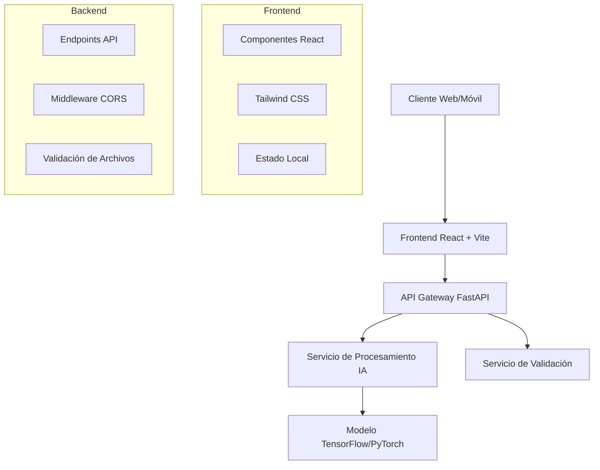

# Documento de Diseño - OncoDerma

## Visión General

OncoDerma es una aplicación web responsiva construida con React.js y FastAPI que proporciona análisis de imágenes de piel usando inteligencia artificial. El sistema está diseñado como una aplicación de página única (SPA) con autenticación básica, procesamiento de imágenes en tiempo real, y una interfaz moderna y accesible.

## Arquitectura

### Arquitectura General del Sistema



### Patrón de Arquitectura

- **Frontend**: Arquitectura basada en componentes con React
- **Backend**: API RESTful con FastAPI siguiendo principios de Clean Architecture
- **Comunicación**: HTTP/HTTPS con JSON para intercambio de datos
- **Estado**: Gestión de estado local con React hooks (useState, useEffect)

## Componentes e Interfaces

### Estructura de Componentes Frontend

```
src/
├── components/
│   ├── auth/
│   │   └── Login.jsx
│   ├── layout/
│   │   ├── NavBar.jsx
│   │   └── Layout.jsx
│   ├── ui/
│   │   ├── ProgressBar.jsx
│   │   ├── Button.jsx
│   │   └── FileUpload.jsx
│   └── common/
│       └── Logo.jsx
├── pages/
│   ├── Home.jsx
│   ├── Analizar.jsx
│   └── Contacto.jsx
├── services/
│   ├── authService.js
│   └── analysisService.js
├── hooks/
│   ├── useAuth.js
│   └── useImageAnalysis.js
└── utils/
    ├── constants.js
    └── validators.js
```

### Interfaces de API

#### Endpoint de Autenticación
```javascript
POST /api/auth/login
Request: {
  username: string,
  password: string
}
Response: {
  success: boolean,
  message: string,
  token?: string
}
```

#### Endpoint de Análisis de Imagen
```javascript
POST /api/analysis/upload
Headers: {
  Content-Type: multipart/form-data
}
Request: FormData con imagen
Response: {
  success: boolean,
  result?: {
    probability: number, // 0-100
    processingTime: number, // en segundos
    confidence: number,
    timestamp: string
  },
  error?: string
}
```

### Componentes Clave

#### 1. Login Component
- **Propósito**: Autenticación con credenciales estáticas
- **Estado**: username, password, loading, error
- **Validación**: Credenciales hardcodeadas (admin/1234)

#### 2. NavBar Component
- **Propósito**: Navegación principal
- **Estado**: activeSection
- **Funcionalidad**: Navegación SPA, responsive menu

#### 3. ProgressBar Component
- **Propósito**: Mostrar resultado del análisis
- **Props**: percentage, size, color
- **Animación**: Transición suave del 0% al resultado

#### 4. FileUpload Component
- **Propósito**: Subida y validación de imágenes
- **Validación**: Tipos de archivo (jpg, png), tamaño máximo
- **Estado**: file, uploading, progress

## Modelos de Datos

### Modelo de Usuario (Frontend)
```javascript
interface User {
  username: string;
  isAuthenticated: boolean;
  loginTime: Date;
}
```

### Modelo de Análisis
```javascript
interface AnalysisResult {
  probability: number;        // 0-100
  processingTime: number;     // segundos
  confidence: number;         // 0-1
  timestamp: string;
  imageMetadata: {
    size: number;
    type: string;
    dimensions: {
      width: number;
      height: number;
    }
  }
}
```

### Modelo de Configuración
```javascript
interface AppConfig {
  colors: {
    primary: '#0F172A';
    secondary: '#1E3A8A';
    accent: '#06B6D4';
    background: '#E2E8F0';
    white: '#FFFFFF';
  };
  api: {
    baseUrl: string;
    timeout: number;
  };
  upload: {
    maxFileSize: number;
    allowedTypes: string[];
  }
}
```

## Manejo de Errores

### Estrategia de Manejo de Errores

#### Frontend
- **Validación de Formularios**: Validación en tiempo real con mensajes claros
- **Errores de Red**: Retry automático con backoff exponencial
- **Errores de Subida**: Mensajes específicos por tipo de error
- **Fallbacks**: Estados de carga y error con opciones de reintento

#### Backend
- **Validación de Archivos**: Verificación de tipo, tamaño y formato
- **Errores del Modelo IA**: Manejo de excepciones con mensajes informativos
- **Rate Limiting**: Protección contra abuso con límites por IP
- **Logging**: Registro detallado para debugging

### Códigos de Error Específicos
```javascript
const ERROR_CODES = {
  AUTH_INVALID_CREDENTIALS: 'INVALID_CREDS',
  FILE_TOO_LARGE: 'FILE_SIZE_EXCEEDED',
  FILE_INVALID_TYPE: 'INVALID_FILE_TYPE',
  PROCESSING_FAILED: 'AI_PROCESSING_ERROR',
  NETWORK_ERROR: 'NETWORK_UNAVAILABLE'
};
```

## Estrategia de Testing

### Testing Frontend
- **Componentes**: Testing Library para componentes React
- **Integración**: Cypress para flujos end-to-end
- **Mocking**: Mock de servicios API para testing aislado

### Testing Backend
- **Unitarias**: pytest para lógica de negocio
- **Integración**: Testing de endpoints con FastAPI TestClient
- **Modelo IA**: Validación con imágenes de prueba conocidas

### Casos de Prueba Críticos
1. **Flujo de Autenticación Completo**
2. **Subida y Procesamiento de Imagen Válida**
3. **Manejo de Archivos Inválidos**
4. **Responsividad en Diferentes Dispositivos**
5. **Rendimiento con Múltiples Usuarios**

## Consideraciones de Seguridad

### Medidas de Seguridad Implementadas

#### Comunicación
- **HTTPS**: Todas las comunicaciones cifradas
- **CORS**: Configuración restrictiva de orígenes permitidos
- **Headers de Seguridad**: CSP, HSTS, X-Frame-Options

#### Procesamiento de Imágenes
- **Validación Estricta**: Verificación de magic numbers
- **Límites de Tamaño**: Máximo 10MB por imagen
- **Eliminación Automática**: Borrado inmediato post-procesamiento
- **Sanitización**: Limpieza de metadatos EXIF

#### Autenticación
- **Credenciales Estáticas**: Solo para demo, no para producción
- **Session Management**: Tokens con expiración
- **Rate Limiting**: Límites por IP y usuario

## Consideraciones de Rendimiento

### Optimizaciones Frontend
- **Code Splitting**: Carga lazy de componentes
- **Image Optimization**: Compresión automática antes de subida
- **Caching**: Cache de assets estáticos
- **Bundle Size**: Análisis y optimización del bundle

### Optimizaciones Backend
- **Async Processing**: Procesamiento asíncrono de imágenes
- **Memory Management**: Liberación inmediata de memoria
- **Connection Pooling**: Gestión eficiente de conexiones
- **Compression**: Compresión gzip de respuestas

### Métricas de Rendimiento
- **Tiempo de Carga**: < 3 segundos
- **Tiempo de Procesamiento**: < 30 segundos por imagen
- **Throughput**: Soporte para 100 usuarios concurrentes
- **Memory Usage**: < 512MB por proceso

## Diseño Visual y UX

### Sistema de Diseño

#### Paleta de Colores
```css
:root {
  --color-primary: #0F172A;      /* Azul muy oscuro */
  --color-secondary: #1E3A8A;    /* Azul médico */
  --color-accent: #06B6D4;       /* Cian claro */
  --color-background: #E2E8F0;   /* Gris claro */
  --color-white: #FFFFFF;        /* Blanco puro */
}
```

#### Tipografía
- **Font Family**: Inter, system-ui, sans-serif
- **Escalas**: text-sm, text-base, text-lg, text-xl, text-2xl
- **Weights**: font-normal (400), font-medium (500), font-semibold (600)

#### Espaciado
- **Sistema**: Múltiplos de 4px (4, 8, 12, 16, 20, 24, 32, 48, 64)
- **Contenedores**: max-width con padding responsive
- **Grid**: CSS Grid y Flexbox para layouts

### Componentes UI Específicos

#### Progress Bar Circular
```javascript
const CircularProgress = ({ percentage, size = 120 }) => {
  const circumference = 2 * Math.PI * 45; // radio 45
  const strokeDashoffset = circumference - (percentage / 100) * circumference;
  
  return (
    <div className="relative">
      <svg width={size} height={size}>
        <circle
          cx={size/2} cy={size/2} r="45"
          stroke="currentColor"
          strokeWidth="8"
          fill="transparent"
          strokeDasharray={circumference}
          strokeDashoffset={strokeDashoffset}
          className="transition-all duration-1000 ease-out"
        />
      </svg>
      <div className="absolute inset-0 flex items-center justify-center">
        <span className="text-2xl font-semibold">{percentage}%</span>
      </div>
    </div>
  );
};
```

## Deployment y DevOps

### Estrategia de Deployment

#### Frontend
- **Build**: Vite para optimización de producción
- **Hosting**: Vercel o Netlify para hosting estático
- **CDN**: Distribución global de assets

#### Backend
- **Containerización**: Docker para consistencia
- **Hosting**: Render, Railway o AWS para APIs
- **Escalabilidad**: Auto-scaling basado en CPU/memoria

### Variables de Entorno
```bash
# Frontend
VITE_API_BASE_URL=https://api.oncoderma.com
VITE_ENVIRONMENT=production

# Backend
API_HOST=0.0.0.0
API_PORT=8000
CORS_ORIGINS=https://oncoderma.com
MAX_FILE_SIZE=10485760
MODEL_PATH=/app/models/skin_cancer_model.pkl
```

### CI/CD Pipeline
1. **Commit** → GitHub webhook
2. **Build** → Tests automáticos
3. **Deploy** → Staging environment
4. **Validation** → Health checks
5. **Production** → Blue-green deployment