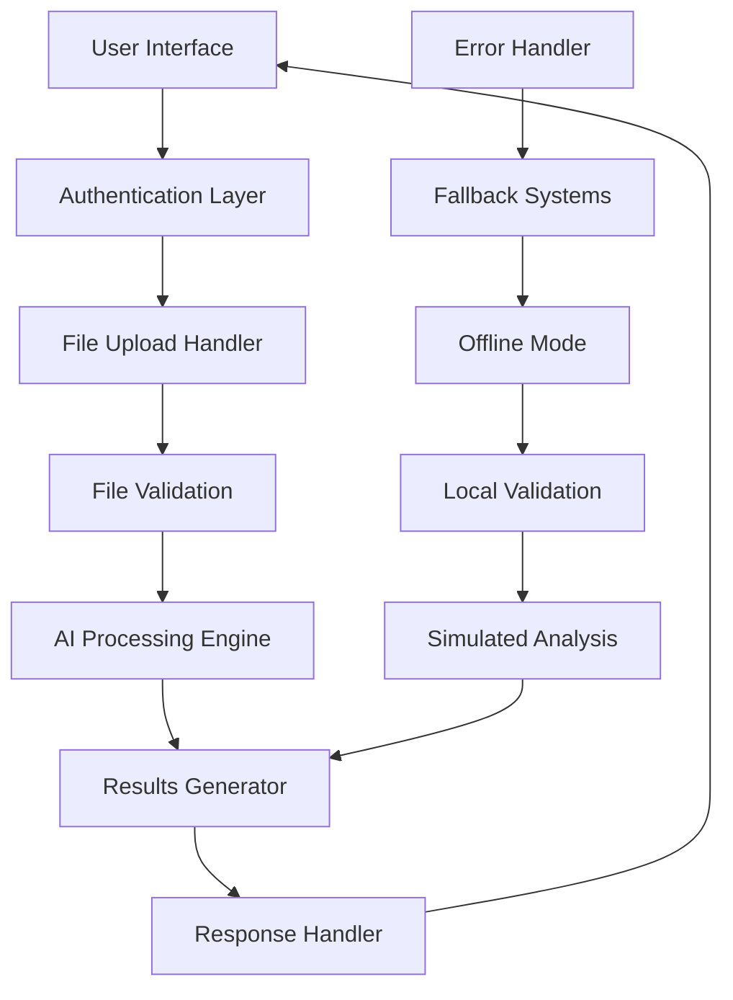

# 🩺 OncoDerma - Plataforma de Análisis de Piel con IA

[](https://github.com/MattFrs12343/SkinCancer/actions)
[](https://reactjs.org/)
[](https://fastapi.tiangolo.com/)
[](https://python.org/)
[](LICENSE)

## 📋 Tabla de Contenidos

- [Descripción General](#descripción-general)
- [Arquitectura](#arquitectura)
- [Stack Tecnológico](#stack-tecnológico)
- [Estructura del Proyecto](#estructura-del-proyecto)
- [Instalación y Configuración](#instalación-y-configuración)
- [Flujo de Desarrollo](#flujo-de-desarrollo)
- [Documentación de la API](#documentación-de-la-api)
- [Sistema de Autenticación](#sistema-de-autenticación)
- [Componentes Frontend](#componentes-frontend)
- [Servicios Backend](#servicios-backend)
- [Pipeline CI/CD](#pipeline-cicd)
- [Pruebas](#pruebas)
- [Despliegue](#despliegue)
- [Contribución](#contribución)
- [Licencia](#licencia)

## 📖 Descripción General

OncoDerma es una aplicación web moderna que aprovecha la inteligencia artificial para analizar imágenes de piel y proporcionar estimaciones de probabilidad para la detección de cáncer de piel. Construida con una arquitectura de microservicios, combina un frontend basado en React con un backend FastAPI para ofrecer una experiencia de usuario fluida.

### 🎯 Características Clave

- **Análisis con IA**: Modelo de aprendizaje automático simulado para análisis de imágenes de piel
- **Procesamiento en Tiempo Real**: Análisis de imágenes con seguimiento de progreso y retroalimentación en vivo
- **Diseño Responsivo**: Enfoque móvil primero con compatibilidad entre dispositivos
- **Autenticación Segura**: Sistema multiusuario con acceso basado en roles
- **Capacidad Offline**: Funcionalidad de respaldo cuando el backend no está disponible
- **UI/UX Moderna**: Interfaz limpia y profesional con cumplimiento de accesibilidad

### 🏥 Casos de Uso

- **Profesionales Médicos**: Herramienta de detección para dermatólogos y proveedores de atención médica
- **Educativo**: Plataforma de entrenamiento y demostración para estudiantes de medicina
- **Investigación**: Recopilación y análisis de datos para investigación de cáncer de piel
- **Salud Pública**: Programas de detección comunitaria y concientización

## ✨ Características Principales

### 🤖 **Análisis con IA Avanzado**

- Modelo de inteligencia artificial simulado para análisis de imágenes
- Procesamiento en tiempo real (2-8 segundos)
- Algoritmos de validación de calidad de imagen
- Soporte para múltiples formatos (JPG, PNG)

### 🎨 **Interfaz Moderna y Responsiva**

- Diseño minimalista y profesional
- **Modo Oscuro/Claro** - Cambio automático según preferencias del sistema
- Totalmente responsiva (móvil, tablet, desktop)
- Navegación intuitiva con React Router
- Componentes reutilizables con Tailwind CSS
- Transiciones suaves entre temas

### 🔒 **Seguridad y Privacidad**

- Procesamiento temporal sin almacenamiento permanente
- Validación estricta de archivos y tipos MIME
- Middleware de seguridad integrado
- Rate limiting y protección CORS

### 🚀 **Funcionalidades Avanzadas**

- Sistema de autenticación con fallback local
- Análisis offline cuando el servidor no está disponible
- Indicadores de estado de conexión en tiempo real
- Sistema de notificaciones y feedback visual

### 📊 **Monitoreo y CI/CD**

- Desarrollo local optimizado
- Hot reload para cambios instantáneos
- Validación de código con ESLint
- Build optimizado para producción

## 🛠️ Stack Tecnológico Completo

### 🎨 **Frontend**

- **React 18** - Framework de interfaz de usuario moderno
- **Vite 4.5** - Herramienta de build ultrarrápida
- **Tailwind CSS 3.3** - Framework de estilos utility-first
- **React Router DOM 6.20** - Navegación SPA avanzada
- **Custom Hooks** - Lógica reutilizable (useAuth, useImageAnalysis, useTheme)
- **Context API** - Gestión de estado global
- **Modo Oscuro** - Sistema completo de temas con persistencia

### ⚙️ **Backend**

- **FastAPI** - Framework web de Python de alto rendimiento
- **Python 3.11** - Lenguaje de programación
- **Pillow (PIL)** - Procesamiento avanzado de imágenes
- **Uvicorn** - Servidor ASGI con recarga automática
- **Pydantic** - Validación de datos y serialización
- **Aiofiles** - Manejo asíncrono de archivos
- **Python-magic** - Validación de tipos MIME

### 🔧 **Herramientas de Desarrollo**

- **ESLint** - Linting de JavaScript/React
- **Autoprefixer** - Compatibilidad CSS automática
- **PostCSS** - Procesamiento de CSS
- **Git** - Control de versiones
- **GitHub Actions** - CI/CD automatizado

### 🔧 **Herramientas de Desarrollo**

- **Vite** - Build tool y dev server optimizado
- **Hot Module Replacement** - Desarrollo en tiempo real

## 📁 Estructura Detallada del Proyecto

```
oncoderma/

├── 📁 frontend/                   # Aplicación React
│   ├── 📁 src/
│   │   ├── 📁 components/        # Componentes React
│   │   │   ├── auth/            # Autenticación (Login, ProtectedRoute)
│   │   │   ├── common/          # Componentes comunes (ContactInfo, etc.)
│   │   │   ├── layout/          # Layout (NavBar, Layout, Footer)
│   │   │   └── ui/              # UI básicos (LoadingSpinner, etc.)
│   │   ├── 📁 pages/            # Páginas principales
│   │   │   ├── Home.jsx         # Página de inicio
│   │   │   ├── Analizar.jsx     # Análisis de imágenes
│   │   │   └── Contacto.jsx     # Página de contacto
│   │   ├── 📁 services/         # Servicios API
│   │   │   ├── authService.js   # Servicio de autenticación
│   │   │   └── analysisService.js # Servicio de análisis
│   │   ├── 📁 hooks/            # Custom hooks
│   │   │   ├── useAuth.jsx      # Hook de autenticación
│   │   │   └── useImageAnalysis.js # Hook de análisis
│   │   ├── 📁 utils/            # Utilidades
│   │   │   └── validators.js    # Validadores de formularios
│   │   ├── App.jsx              # Componente principal
│   │   └── main.jsx             # Punto de entrada
│   ├── 📁 public/               # Assets públicos
│   │   ├── img/                 # Imágenes (logo, etc.)
│   │   ├── vite.svg             # Favicon de Vite
│   │   └── favicon.ico          # Favicon personalizado
│   ├── package.json             # Dependencias frontend
│   ├── vite.config.js           # Configuración Vite
│   └── tailwind.config.js       # Configuración Tailwind
├── 📁 backend/                   # API FastAPI
│   ├── 📁 app/
│   │   ├── 📁 api/              # Endpoints de la API
│   │   │   └── routes/
│   │   │       ├── auth.py      # Rutas de autenticación
│   │   │       └── analysis.py  # Rutas de análisis
│   │   ├── 📁 core/             # Configuración central
│   │   │   ├── config.py        # Configuración de la app
│   │   │   └── security.py      # Middleware de seguridad
│   │   ├── 📁 models/           # Modelos de IA
│   │   │   └── ai_model.py      # Modelo de análisis simulado
│   │   ├── 📁 schemas/          # Modelos Pydantic
│   │   │   ├── auth.py          # Esquemas de autenticación
│   │   │   └── analysis.py      # Esquemas de análisis
│   │   └── main.py              # Aplicación principal FastAPI
│   ├── requirements.txt         # Dependencias Python
│   └── temp_uploads/            # Directorio temporal (auto-creado)
├── 📁 img/                      # Assets del proyecto
│   └── OncoDerma-Logo.png       # Logo principal
├── 📁 scripts/                  # Scripts de utilidad
├── 📄 README.md                 # Documentación principal
├── 📄 .env.example              # Variables de entorno ejemplo

```

## 🚀 Instalación y Configuración Completa

### 📋 Prerrequisitos

- **Node.js 18+** - [Descargar aquí](https://nodejs.org/)
- **Python 3.11+** - [Descargar aquí](https://python.org/)
- **Git** - [Descargar aquí](https://git-scm.com/)
- **npm** o **yarn** (incluido con Node.js)

### 📥 Clonación del Repositorio

```bash
git clone https://github.com/MattFrs12343/SkinCancer.git
cd SkinCancer
```

### 🎨 Configuración del Frontend

```bash
# Navegar al directorio frontend
cd frontend

# Instalar dependencias
npm install

# Iniciar servidor de desarrollo
npm run dev
```

**URLs disponibles:**

- 🌐 **Aplicación**: `http://localhost:3000`
- 📱 **Móvil**: `http://localhost:3000` (responsiva)

**Scripts disponibles:**

```bash
npm run dev          # Servidor de desarrollo
npm run build        # Build de producción
npm run preview      # Preview del build
npm run lint         # Linting del código
npm run lint:fix     # Corregir errores de lint automáticamente
```

### ⚙️ Configuración del Backend

```bash
# Navegar al directorio backend (desde la raíz)
cd backend

# Crear entorno virtual (recomendado)
python -m venv venv
source venv/bin/activate  # En Windows: venv\Scripts\activate

# Instalar dependencias
pip install -r requirements.txt

# Iniciar servidor FastAPI
py -m uvicorn app.main:app --reload --host 0.0.0.0 --port 8000
```

**URLs disponibles:**

- 🔧 **API**: `http://localhost:8000`
- 📚 **Documentación**: `http://localhost:8000/docs` (Swagger UI)
- 📖 **Redoc**: `http://localhost:8000/redoc`
- ❤️ **Health Check**: `http://localhost:8000/health`

### 🔧 Configuración de Variables de Entorno

Crea un archivo `.env` en la raíz del proyecto:

```bash
# Copia el archivo de ejemplo
cp .env.example .env
```

Variables principales:

```env
# API Configuration
API_HOST=0.0.0.0
API_PORT=8000
DEBUG=true

# Security
SECRET_KEY=tu-clave-secreta-aqui

# File Upload
MAX_FILE_SIZE=10485760  # 10MB
UPLOAD_DIR=./temp_uploads
```


## 🔐 Sistema de Autenticación

### 👤 Credenciales de Prueba

Para acceder a la aplicación, usa cualquiera de estos usuarios con la **contraseña estática: `1234`**

| Usuario    | Nombre Completo  | Rol           | Email                  |
| ---------- | ---------------- | ------------- | ---------------------- |
| `Matias`   | Matias Franco    | Administrador | matias@oncoderma.com   |
| `Bianca`   | Bianca Sánchez   | Doctora       | bianca@oncoderma.com   |
| `Melissa`  | Melissa Duran    | Especialista  | melissa@oncoderma.com  |
| `Carlos`   | Carlos Berrios   | Médico        | carlos@oncoderma.com   |
| `Invitado` | Usuario Invitado | Invitado      | invitado@oncoderma.com |
| `admin`    | Administrador    | Admin         | admin@oncoderma.com    |

> 🔑 **Contraseña única**: Todos los usuarios usan la contraseña `1234`

### 🔒 Características de Seguridad

- **Autenticación híbrida**: Backend + fallback local
- **Tokens JWT**: Manejo seguro de sesiones
- **Rate limiting**: Protección contra ataques
- **Validación de entrada**: Sanitización de datos
- **CORS configurado**: Orígenes permitidos específicos

### 🚨 Modo Offline

Si el backend no está disponible, la aplicación funciona en **modo local**:

- Validación de credenciales local
- Análisis simulado de imágenes
- Funcionalidad completa sin servidor

> ⚠️ **Nota**: Estas son credenciales de demostración únicamente. En producción, implementar autenticación robusta.

## 🎨 Sistema de Temas y Colores

### 🌞 **Tema Claro (Por defecto)**

- **Primary**: `#0F172A` - Azul muy oscuro para texto
- **Secondary**: `#1E3A8A` - Azul médico clásico
- **Accent**: `#06B6D4` - Cian claro para acentos
- **Background**: `#E2E8F0` - Gris muy claro de fondo
- **White**: `#FFFFFF` - Blanco puro

### 🌙 **Tema Oscuro**

- **Primary**: `#E2E8F0` - Texto claro principal
- **Secondary**: `#93C5FD` - Azul claro para subtítulos/destacar
- **Accent**: `#06B6D4` - Mantiene el cian para acentos
- **Background**: `#0F172A` - Fondo principal muy oscuro
- **White**: `#1E293B` - Gris azulado oscuro para componentes

### ⚙️ **Funcionalidades del Sistema de Temas**

- **Detección automática** de preferencias del sistema
- **Persistencia** en localStorage
- **Toggle manual** en la interfaz
- **Transiciones suaves** entre temas
- **Meta theme-color** dinámico para móviles
- **Variables CSS** para máxima flexibilidad

## 📱 Guía de Uso Completa

### 🔑 **1. Acceso a la Aplicación**

1. Abre `http://localhost:3000` en tu navegador
2. **Cambiar tema**: Usa el toggle en la esquina superior derecha (login) o en la barra de navegación
3. Ingresa credenciales de prueba (ver sección anterior)
4. El sistema validará automáticamente (backend o local)

### 🧭 **2. Navegación Principal**

- **🏠 Home**: Página de bienvenida con información general
- **🔬 Analizar**: Herramienta principal de análisis de imágenes
- **📞 Contacto**: Información de soporte y FAQ

### 🔬 **3. Proceso de Análisis**

#### Paso 1: Preparación de Imagen

- **Formatos soportados**: JPG, PNG
- **Tamaño máximo**: 10MB
- **Resolución mínima**: 50x50 píxeles
- **Recomendaciones**: Imagen clara, bien iluminada, enfocada

#### Paso 2: Subida y Análisis

1. Click en "Seleccionar imagen" o arrastra archivo
2. Previsualización automática de la imagen
3. Click en "Analizar imagen"
4. Espera 2-8 segundos (procesamiento en tiempo real)

#### Paso 3: Interpretación de Resultados

- **Barra circular**: Porcentaje de probabilidad visual
- **Nivel de confianza**: Precisión del análisis
- **Tiempo de procesamiento**: Duración del análisis
- **Metadatos**: Información técnica de la imagen

### 📊 **4. Interpretación de Resultados**

| Rango  | Interpretación  | Acción Recomendada          |
| ------ | --------------- | --------------------------- |
| 0-25%  | Bajo riesgo     | Monitoreo regular           |
| 26-55% | Riesgo moderado | Consulta médica recomendada |
| 56-85% | Alto riesgo     | Consulta médica urgente     |

> ⚠️ **Importante**: Estos resultados son estimaciones. Siempre consulta con un profesional médico.

### 📞 **5. Soporte y Contacto**

- **WhatsApp**: 67708839 (24/7)
- **Email**: soporte@oncoderma.com
- **FAQ**: Preguntas frecuentes en la app
- **Horarios**: Lun-Dom 8:00-22:00 (soporte técnico)

## 🔒 Seguridad y Privacidad

- Las imágenes se procesan temporalmente y se eliminan inmediatamente
- Comunicación cifrada con HTTPS
- No se almacenan datos personales ni imágenes
- Validación estricta de tipos y tamaños de archivo

## ⚠️ Disclaimer Médico

**IMPORTANTE**: Esta aplicación es únicamente una herramienta de apoyo y NO reemplaza el diagnóstico médico profesional. Siempre consulta con un dermatólogo o especialista para evaluación y diagnóstico definitivo.

## 🤝 Contribución

Este es un proyecto de demostración. Para contribuir:

1. Fork el proyecto
2. Crea una rama para tu feature
3. Commit tus cambios
4. Push a la rama
5. Abre un Pull Request

## 📄 Licencia

Este proyecto es solo para fines educativos y de demostración.

## � CIn/CD y GitHub Actions

### 🎯 **Triggers Automáticos Configurados**

El proyecto incluye un sistema completo de CI/CD con GitHub Actions:

#### 📋 **1. Commit Trigger** (`commit-trigger.yml`)

- **Se ejecuta**: En cada commit a cualquier rama
- **Funciones**:
  - Notifica detalles del commit
  - Analiza tipo de cambio (feat, fix, docs, etc.)
  - Muestra archivos modificados
  - Genera reportes automáticos

#### 🔄 **2. CI/CD Pipeline** (`ci-cd.yml`)

- **Se ejecuta**: En commits a master/main/develop
- **Incluye**:
  - Validación de sintaxis y estilo de código
  - Build de prueba para verificar integridad
  - Optimización de assets y recursos

### 📊 **Monitoreo**

Puedes ver todos los workflows en:
**https://github.com/MattFrs12343/SkinCancer/actions**

## 🎨 Paleta de Colores y Diseño

### 🎨 **Colores Principales**

```css
:root {
  --primary: #0f172a; /* Azul muy oscuro */
  --secondary: #1e3a8a; /* Azul médico clásico */
  --accent: #06b6d4; /* Cian claro para acentos */
  --background: #e2e8f0; /* Gris muy claro de fondo */
  --white: #ffffff; /* Blanco puro */
  --gray-50: #f8fafc; /* Gris muy claro */
  --gray-600: #475569; /* Gris medio */
  --red-600: #dc2626; /* Rojo para errores */
  --green-600: #059669; /* Verde para éxito */
}
```

### 🎯 **Principios de Diseño**

- **Minimalismo**: Interfaz limpia y enfocada
- **Accesibilidad**: Contraste adecuado y navegación clara
- **Responsividad**: Adaptable a todos los dispositivos
- **Consistencia**: Componentes reutilizables y coherentes

## 🧪 Testing y Calidad

### ✅ **Frontend Testing**

```bash
cd frontend
npm run lint          # ESLint
npm run lint:fix      # Corrección automática
npm run type-check    # Verificación de tipos (si aplica)
```

### 🐍 **Backend Testing**

```bash
cd backend
flake8 .              # Linting Python
python -m py_compile app/main.py  # Verificación sintaxis
```

### 📊 **Métricas de Calidad**

- **Cobertura de código**: Configurada en CI/CD
- **Performance**: Optimización de builds
- **Seguridad**: Validación automática de dependencias

## 📞 Contacto y Soporte

### 📱 **Canales de Contacto**

- **WhatsApp**: 67708839 (24/7)
- **Email**: soporte@oncoderma.com
- **GitHub Issues**: Para reportar bugs o sugerir mejoras
- **Documentación**: README.md y comentarios en código

### 🕐 **Horarios de Atención**

- **WhatsApp**: 24/7 (respuesta automática)
- **Soporte técnico**: Lun-Dom 8:00-22:00
- **Consultas médicas**: Lun-Vie 9:00-18:00
- **Respuesta promedio**: < 2 horas

### 🆘 **Emergencias Médicas**

> ⚠️ **Para emergencias médicas, NO uses esta aplicación. Contacta servicios de emergencia (911) o tu médico inmediatamente.**

---

**Desarrollado con ❤️ para mejorar la detección temprana de cáncer de piel**

## 🤝 Con

tribución y Desarrollo

### 🔄 **Proceso de Contribución**

1. **Fork** el repositorio
2. **Clona** tu fork localmente
3. **Crea** una rama para tu feature:
   ```bash
   git checkout -b feature/nueva-funcionalidad
   ```
4. **Desarrolla** siguiendo las convenciones del proyecto
5. **Commit** con mensajes descriptivos:
   ```bash
   git commit -m "feat: ✨ agregar nueva funcionalidad X"
   ```
6. **Push** a tu rama:
   ```bash
   git push origin feature/nueva-funcionalidad
   ```
7. **Abre** un Pull Request con descripción detallada

### 📝 **Convenciones de Commit**

Usamos [Conventional Commits](https://www.conventionalcommits.org/):

- `feat: ✨` - Nueva funcionalidad
- `fix: 🐛` - Corrección de bug
- `docs: 📚` - Cambios en documentación
- `style: 💄` - Cambios de formato/estilo
- `refactor: ♻️` - Refactorización de código
- `test: 🧪` - Agregar o modificar tests
- `chore: 🔧` - Tareas de mantenimiento

### 🛠️ **Configuración de Desarrollo**

```bash
# Instalar hooks de pre-commit (recomendado)
cd frontend && npm run prepare

# Verificar código antes de commit
npm run lint
npm run type-check

# En backend
flake8 .
python -m py_compile app/main.py
```

### 🎯 **Áreas de Contribución**

- 🤖 **IA/ML**: Mejorar algoritmos de análisis
- 🎨 **Frontend**: Nuevos componentes y UX
- ⚙️ **Backend**: APIs y optimizaciones
- 📱 **Mobile**: Mejoras responsive
- 🧪 **Testing**: Cobertura de tests
- 📚 **Docs**: Documentación y tutoriales
- 🔒 **Security**: Auditorías de seguridad

## 🚀 Roadmap y Futuras Mejoras

### 📋 **Próximas Funcionalidades**

- [ ] 🤖 Integración con modelo de IA real
- [ ] 📱 Aplicación móvil nativa (React Native)
- [ ] 🔐 Sistema de usuarios completo
- [ ] 📊 Dashboard de estadísticas
- [ ] 🌍 Internacionalización (i18n)
- [ ] 📧 Sistema de notificaciones por email
- [ ] 🔄 Historial de análisis
- [ ] 👥 Sistema de roles y permisos

### 🎯 **Mejoras Técnicas**

- [ ] ⚡ Optimización de performance
- [ ] 🧪 Cobertura de tests al 90%
- [ ] 🐳 Containerización completa
- [ ] 🔧 Optimización de performance
- [ ] 📈 Monitoreo y métricas
- [ ] 🔍 Logging avanzado
- [ ] 🛡️ Auditoría de seguridad

## 📄 Licencia y Legal

### 📋 **Licencia**

Este proyecto es para **fines educativos y de demostración únicamente**.

### ⚖️ **Disclaimer Legal**

- Esta aplicación NO es un dispositivo médico
- NO reemplaza el diagnóstico médico profesional
- Los resultados son estimaciones con fines educativos
- Siempre consulta con profesionales médicos calificados

### 🔒 **Privacidad**

- No se almacenan imágenes permanentemente
- No se recopilan datos personales
- Procesamiento local cuando es posible
- Cumplimiento con regulaciones de privacidad

## 🏆 Reconocimientos

### 👥 **Equipo de Desarrollo**

- **Matias Franco** - Desarrollador Principal
- **GitHub**: [@MattFrs12343](https://github.com/MattFrs12343)

### 🛠️ **Tecnologías Utilizadas**

Agradecimientos a las tecnologías y librerías que hacen posible este proyecto:

- React.js y el ecosistema de JavaScript
- FastAPI y la comunidad de Python
- Tailwind CSS por el sistema de diseño
- GitHub por la plataforma de desarrollo

### 📚 **Recursos y Referencias**

- [Documentación de React](https://reactjs.org/docs)
- [FastAPI Documentation](https://fastapi.tiangolo.com/)
- [Tailwind CSS](https://tailwindcss.com/)
- [GitHub Actions](https://docs.github.com/en/actions)

---

<div align="center">

**🩺 Desarrollado con ❤️ para mejorar la detección temprana de cáncer de piel**

[](https://github.com/MattFrs12343)
[](mailto:francosalvatierram@gmail.com)

**⭐ Si este proyecto te resulta útil, considera darle una estrella en GitHub**

</div>

## 🏗️ Arquitectura

### 🎯 Arquitectura del Sistema

```
┌─────────────────┐    ┌─────────────────┐    ┌─────────────────┐
│   Frontend      │    │   Backend       │    │   AI Model      │
│   (React SPA)   │◄──►│   (FastAPI)     │◄──►│   (Simulated)   │
│                 │    │                 │    │                 │
│ • React 18      │    │ • FastAPI       │    │ • NumPy         │
│ • Vite          │    │ • Uvicorn       │    │ • PIL/Pillow    │
│ • Tailwind CSS  │    │ • Pydantic      │    │ • Custom Logic  │
│ • React Router  │    │ • Aiofiles      │    │                 │
└─────────────────┘    └─────────────────┘    └─────────────────┘
         │                       │                       │
         │                       │                       │
         ▼                       ▼                       ▼
┌─────────────────┐    ┌─────────────────┐    ┌─────────────────┐
│   Static Files  │    │   File Storage  │    │   Temp Storage  │
│   (Public)      │    │   (Temporary)   │    │   (Processing)  │
└─────────────────┘    └─────────────────┘    └─────────────────┘
```

### 🔄 Arquitectura de Flujo de Datos



### 🛡️ Arquitectura de Seguridad

```
Internet → CORS → Rate Limiting → Authentication → File Validation → Processing → Response
    ↓         ↓         ↓              ↓               ↓              ↓           ↓
  HTTPS    Origins   IP-based      JWT/Local      MIME/Size      Temp Files   Sanitized
```

## 🛠️ Stack Tecnológico

### 🎨 Stack Frontend

| Tecnología       | Versión | Propósito            | Configuración                        |
| ---------------- | ------- | -------------------- | ------------------------------------ |
| **React**        | 18.2.0  | Framework UI         | JSX, Hooks, Context API              |
| **Vite**         | 4.5.0   | Herramienta de Build | HMR, ES Modules, Optimización        |
| **Tailwind CSS** | 3.3.5   | Estilos              | Utility-first, Responsivo            |
| **React Router** | 6.20.1  | Navegación           | SPA Routing, Rutas Protegidas        |
| **ESLint**       | 8.53.0  | Calidad de Código    | Plugins React, Reglas personalizadas |

### ⚙️ Stack Backend

| Tecnología   | Versión | Propósito                 | Configuración                      |
| ------------ | ------- | ------------------------- | ---------------------------------- |
| **FastAPI**  | Última  | Framework Web             | Async, Auto-docs, Validación       |
| **Python**   | 3.11+   | Runtime                   | Type hints, Sintaxis moderna       |
| **Uvicorn**  | Última  | Servidor ASGI             | Auto-reload, Multi-worker          |
| **Pydantic** | 2.5.0   | Validación de Datos       | Type safety, Serialización         |
| **Pillow**   | 10.1.0  | Procesamiento de Imágenes | Soporte de formatos, Validación    |
| **NumPy**    | 1.24.3  | Computación Numérica      | Operaciones de arrays, Matemáticas |

### 🔧 Herramientas de Desarrollo

| Herramienta        | Propósito          | Configuración                    |
| ------------------ | ------------------ | -------------------------------- |
| **Vite**           | Build Tool         | Dev server, HMR, Optimización    |
| **PostCSS**        | CSS Processing     | Autoprefixer, Optimización        |
| **ESLint**         | Linting JavaScript | Reglas React, Mejores prácticas  |
| **Prettier**       | Formateo de Código | Estilo consistente, Auto-formato |

## 📁 Detailed Project Structure

```
oncoderma/
├── 📁 .github/                           # GitHub Actions & Workflows
│   └── workflows/

│
├── 📁 frontend/                         # React Application
│   ├── 📁 public/                       # Static Assets
│   │   ├── img/                         # Images & Icons
│   │   │   ├── OncoDerma-Logo.png      # Main logo
│   │   │   ├── medical-analysis.svg     # Medical illustration
│   │   │   ├── ai-technology.svg        # AI technology illustration
│   │   │   ├── security-privacy.svg     # Security illustration
│   │   │   ├── avatar-maria-gonzalez.svg # User testimonial avatar
│   │   │   └── avatar-dr-carlos-ruiz.svg # Doctor testimonial avatar
│   │   ├── vite.svg                     # Vite favicon
│   │   └── favicon.ico                  # Custom favicon
│   │
│   ├── 📁 src/                          # Source Code
│   │   ├── 📁 components/               # React Components
│   │   │   ├── 📁 auth/                 # Authentication Components
│   │   │   │   ├── Login.jsx            # Login form with validation
│   │   │   │   └── ProtectedRoute.jsx   # Route protection HOC
│   │   │   ├── 📁 common/               # Shared Components
│   │   │   │   ├── ContactInfo.jsx      # Contact information display
│   │   │   │   ├── ConnectionStatus.jsx # Real-time connection status
│   │   │   │   ├── SystemInfo.jsx       # System information display
│   │   │   │   ├── PerformanceMetrics.jsx # Performance monitoring
│   │   │   │   └── ResourcePreloader.jsx # Asset preloading
│   │   │   ├── 📁 layout/               # Layout Components
│   │   │   │   ├── Layout.jsx           # Main layout wrapper
│   │   │   │   └── NavBar.jsx           # Navigation bar with responsive menu
│   │   │   └── 📁 ui/                   # UI Components
│   │   │       ├── FileUpload.jsx       # Drag & drop file upload
│   │   │       ├── LoadingSpinner.jsx   # Loading indicators
│   │   │       └── ProgressBar.jsx      # Progress visualization
│   │   │
│   │   ├── 📁 pages/                    # Page Components
│   │   │   ├── Home.jsx                 # Landing page with features
│   │   │   ├── Analizar.jsx             # Image analysis interface
│   │   │   ├── FAQ.jsx                  # Frequently asked questions
│   │   │   └── Contacto.jsx             # Contact information
│   │   │
│   │   ├── 📁 services/                 # API Services
│   │   │   ├── authService.js           # Authentication API calls
│   │   │   └── analysisService.js       # Image analysis API calls
│   │   │
│   │   ├── 📁 hooks/                    # Custom React Hooks
│   │   │   ├── useAuth.jsx              # Authentication state management
│   │   │   └── useImageAnalysis.js      # Image analysis state management
│   │   │
│   │   ├── 📁 utils/                    # Utility Functions
│   │   │   ├── constants.js             # Application constants
│   │   │   └── validators.js            # Form validation functions
│   │   │
│   │   ├── App.jsx                      # Root component with routing
│   │   ├── main.jsx                     # Application entry point
│   │   └── index.css                    # Global styles
│   │
│   ├── package.json                     # Frontend dependencies
│   ├── vite.config.js                   # Vite configuration
│   ├── tailwind.config.js               # Tailwind CSS configuration
│   ├── postcss.config.js                # PostCSS configuration
│   └── eslint.config.js                 # ESLint configuration
│
├── 📁 backend/                          # FastAPI Application
│   ├── 📁 app/                          # Application Package
│   │   ├── 📁 api/                      # API Layer
│   │   │   └── routes/                  # API Route Handlers
│   │   │       ├── auth.py              # Authentication endpoints
│   │   │       └── analysis.py          # Image analysis endpoints
│   │   │
│   │   ├── 📁 core/                     # Core Configuration
│   │   │   ├── config.py                # Application settings
│   │   │   └── security.py              # Security middleware & utilities
│   │   │
│   │   ├── 📁 models/                   # AI Models
│   │   │   └── ai_model.py              # Simulated AI model implementation
│   │   │
│   │   ├── 📁 schemas/                  # Pydantic Models
│   │   │   ├── auth.py                  # Authentication data models
│   │   │   └── analysis.py              # Analysis data models
│   │   │
│   │   └── main.py                      # FastAPI application factory
│   │
│   ├── requirements.txt                 # Python dependencies
│   └── temp_uploads/                    # Temporary file storage (auto-created)
│
├── 📁 img/                              # Project Assets
│   └── OncoDerma-Logo.png               # Original logo file
│
├── 📁 scripts/                          # Utility Scripts
├── 📄 README.md                         # Project documentation
├── 📄 .env.example                      # Environment variables template
├── 📄 .gitignore                        # Git ignore rules

```

## 🚀 Quick Start Commands

### 🎯 Development Environment Setup

```bash
# Clone the repository
git clone https://github.com/MattFrs12343/SkinCancer.git
cd SkinCancer

# Frontend setup (Terminal 1)
cd frontend
npm install
npm run dev

# Backend setup (Terminal 2)
cd backend
pip install -r requirements.txt
py -m uvicorn app.main:app --reload --host 0.0.0.0 --port 8000
```

### 🌐 Application URLs

| Service               | URL                          | Description            |
| --------------------- | ---------------------------- | ---------------------- |
| **Frontend**          | http://localhost:3000        | React application      |
| **Backend API**       | http://localhost:8000        | FastAPI server         |
| **API Documentation** | http://localhost:8000/docs   | Interactive Swagger UI |
| **Alternative Docs**  | http://localhost:8000/redoc  | ReDoc documentation    |
| **Health Check**      | http://localhost:8000/health | API health status      |

### 👥 Test User Credentials

| Username   | Full Name      | Role          | Password |
| ---------- | -------------- | ------------- | -------- |
| `Matias`   | Matias Franco  | Administrator | `1234`   |
| `Bianca`   | Bianca Sánchez | Doctor        | `1234`   |
| `Melissa`  | Melissa Duran  | Specialist    | `1234`   |
| `Carlos`   | Carlos Berrios | Doctor        | `1234`   |
| `Invitado` | Guest User     | Guest         | `1234`   |
| `admin`    | Administrator  | Admin         | `1234`   |

> 🔑 **Static Password**: All users share the password `1234` for demo purposes
